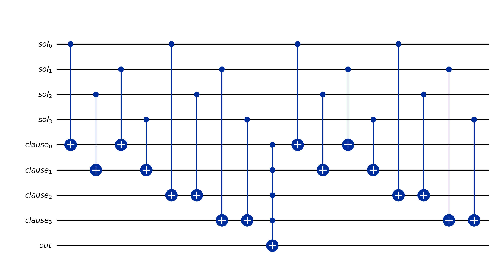
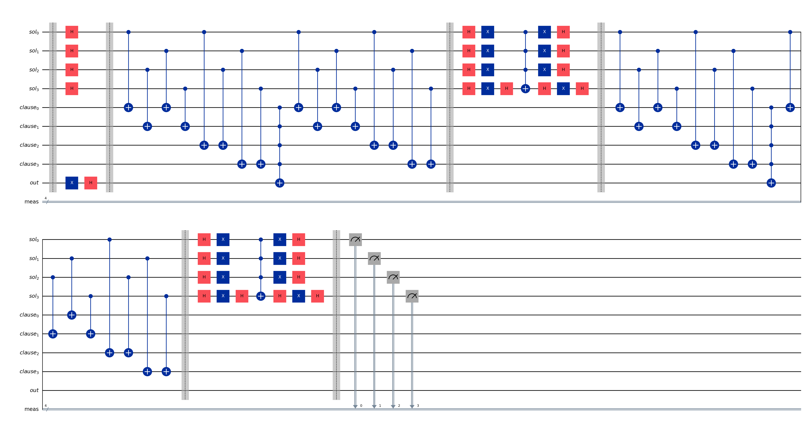
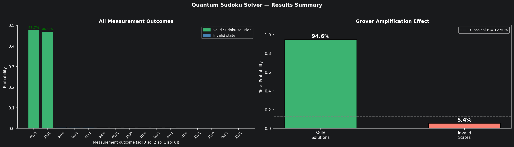

# Quantum 2×2 Sudoku Solver using Grover's Algorithm

**Course:** Advanced Computer Architecture — Final Project  
**Author:** Talha Ahmed  
**Framework:** IBM Qiskit · AerSimulator

---

## Overview

This project implements **Grover's quantum search algorithm** to solve a 2×2 Sudoku puzzle. The quantum circuit explores all 16 possible cell assignments simultaneously via superposition and amplifies the probability of valid solutions through iterative phase kickback and diffusion — achieving a **7.6× speedup** over classical random search.

### Results at a Glance

| Metric | Value |
|--------|-------|
| Search space | 16 states (2⁴) |
| Valid solutions | 2 |
| Grover iterations | 2 (optimal) |
| Theoretical P(success) | 94.53% |
| Simulated P(success) | ~94.59% |
| Classical P(success) | 12.50% |
| Quantum speedup | **7.6×** |

---

## The Problem: 2×2 Sudoku

Fill a 2×2 grid with digits from **{1, 2}** such that every row and column contains distinct values.

```
┌───┬───┐
│ ? │ ? │   Row 0: cell[0,0] ≠ cell[0,1]
├───┼───┤
│ ? │ ? │   Row 1: cell[1,0] ≠ cell[1,1]
└───┴───┘
Col 0: cell[0,0] ≠ cell[1,0]     Col 1: cell[0,1] ≠ cell[1,1]
```

**Binary encoding:** digit 1 → |0⟩, digit 2 → |1⟩

The two valid solutions are:

```
┌───┬───┐      ┌───┬───┐
│ 1 │ 2 │      │ 2 │ 1 │
├───┼───┤  and ├───┼───┤
│ 2 │ 1 │      │ 1 │ 2 │
└───┴───┘      └───┴───┘
```

---

## Grover's Algorithm

Grover's algorithm finds a marked state among N total states with M solutions in **O(√(N/M))** oracle queries — a quadratic speedup over classical O(N/M) search.

**Three stages per iteration:**

1. **Superposition** — initialize all 2⁴ states equally with Hadamard gates
2. **Oracle** — flip the phase of valid solution states (phase kickback via |−⟩ ancilla)
3. **Diffusion** — amplify the probability of phase-flipped states (reflect about uniform superposition)

The optimal number of iterations: $k = \left\lfloor \dfrac{\pi}{4} \sqrt{\dfrac{N}{M}} \right\rceil$

For this problem (N=16, M=2): **k = 2**, giving P(success) = 94.53%.

---

## Circuit Architecture

### Qubit Registers

| Register | Size | Role |
|----------|------|------|
| `sol[0..3]` | 4 | Solution qubits — one per Sudoku cell |
| `clause[0..3]` | 4 | Ancilla — one per constraint (row/col) |
| `out` | 1 | Phase-kickback qubit, initialized to \|−⟩ |

**Total: 9 qubits, 4 classical bits**

### Circuit Statistics (post-build)

| Property | Value |
|----------|-------|
| Total qubits | 9 |
| Classical bits | 4 |
| Circuit depth | 35 |
| CX gates | 32 |
| Hadamard gates | 25 |

### Oracle Design

For each of the 4 uniqueness constraints, the oracle computes `clause[k] = sol[i] XOR sol[j]` (a 1 indicates the constraint is satisfied). When all 4 clause qubits are |1⟩, a multi-controlled-X gate on the |−⟩ output qubit applies a −1 global phase to the valid state. The clause qubits are then uncomputed to restore them to |0⟩.

```
sol[i] ──●────────────────●──
sol[j] ──⊕────────────────⊕──   clause[k] = sol[i] ⊕ sol[j]
         ...
clause[0..3] ──────────────●──
out |−⟩  ──────────────────⊕──  phase kickback: −1 applied to valid states
```

---

## Circuit Diagrams

| Oracle Circuit | Full Grover Circuit |
|---|---|
|  |  |

**Measurement histogram:**



---

## Project Structure

```
.
├── quantum_sudoku_grover.ipynb   # Main notebook (full implementation + results)
├── environment.yml               # Conda environment definition
├── requirements.txt              # pip dependencies
├── oracle_circuit.png            # Phase oracle circuit diagram
├── grover_circuit.png            # Full Grover circuit diagram
└── grover_results.png            # Measurement histogram and amplification plot
```

---

## Getting Started

### Option A — Conda (recommended)

```bash
conda env create -f environment.yml
conda activate quantum-sudoku
python -m ipykernel install --user --name quantum-sudoku --display-name "Python (quantum-sudoku)"
jupyter lab quantum_sudoku_grover.ipynb
```

### Option B — pip

```bash
pip install -r requirements.txt
jupyter lab quantum_sudoku_grover.ipynb
```

**Requirements:** Python 3.11, Qiskit ≥ 1.1, Qiskit-Aer ≥ 0.14, NumPy ≥ 1.26, Matplotlib ≥ 3.8

---

## Key Implementation Classes

| Class | File | Description |
|-------|------|-------------|
| `SudokuPuzzle` | notebook | Encodes constraints; brute-force classical verification |
| `SudokuOracle` | notebook | Phase oracle using XOR clauses + phase kickback |
| `GroverSolver` | notebook | Full Grover circuit: init → oracle → diffusion → measure |

---

## References

- Grover, L. K. (1996). *A fast quantum mechanical algorithm for database search*. STOC '96.
- [Qiskit Documentation](https://docs.quantum.ibm.com/)
- [Qiskit Aer Simulator](https://qiskit.github.io/qiskit-aer/)
